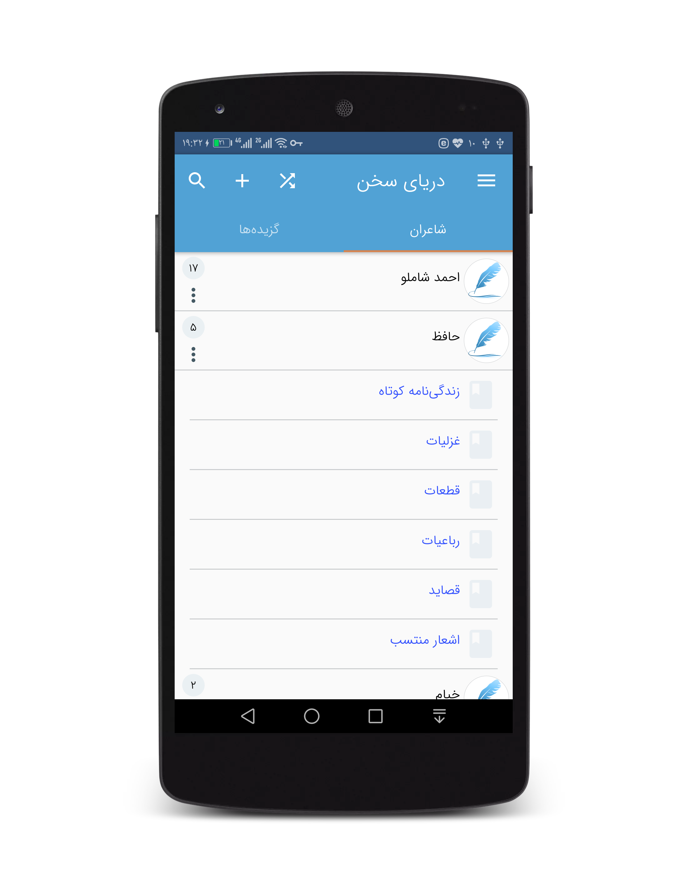
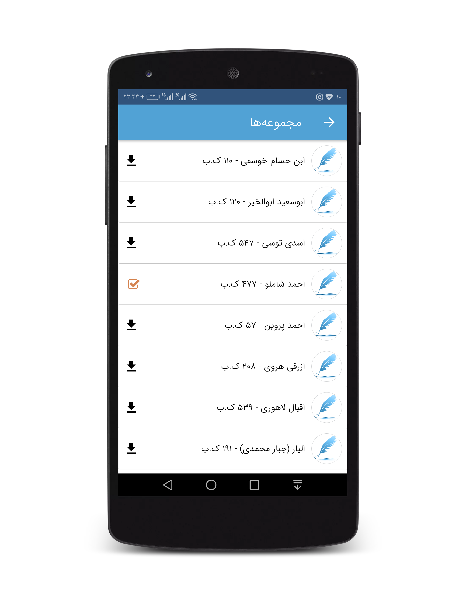
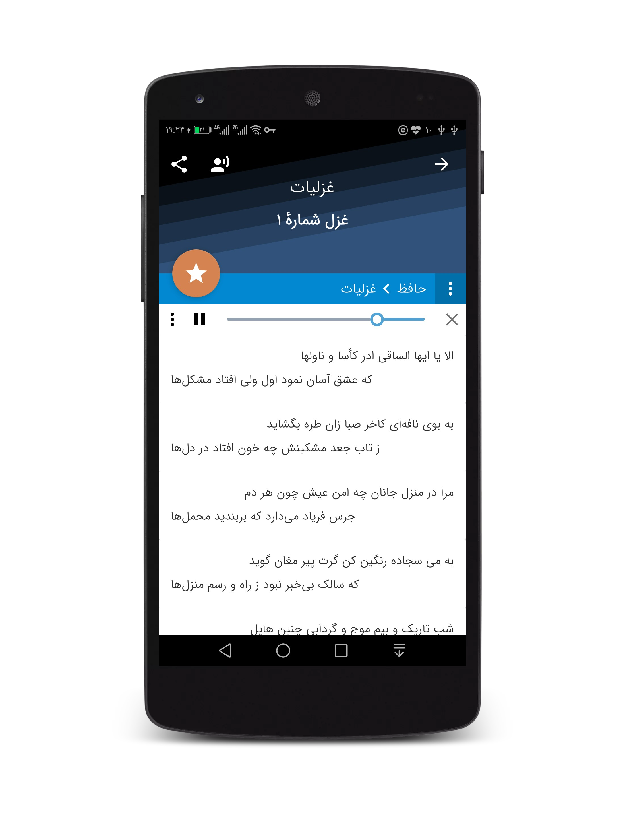

## Sea of Poetry(Daryaye sokhan)
 The Sea of Poetry(Daryaye Sokhan) is a valuable library of poetry of Persian great poets.
 
## Useful information:
* IDE: Android Studio Android Studio Flamingo | 2022.2.1 Patch
* Programming language: Java

## Used repositories:
* [ganjooroid](https://github.com/ganjoor/ganjooroid)
* [ganjoor](https://github.com/ganjoor/ganjoor)
* [PhotoEditor](https://github.com/burhanrashid52/PhotoEditor)
* [Rastikerdar Fonts](https://rastikerdar.github.io/)

## APK Link
* [Google Play](https://play.google.com/store/apps/details?id=ir.ham3da.darya)
* [کافه‌بازار](https://cafebazaar.ir/app/ir.ham3da.darya)
* [مایکت](https://myket.ir/app/ir.ham3da.darya)

## Donation with cryptocurrencies

* <b>Address:</b> 0xD6735B2457c3c1E25122220Cf3067C614Cf18Bc4 (Available on Ethereum, Binance Smart, Ethereum Classic and Polygon (Matic) networks)
* <b>Tron:</b> TTahPYiMfWygFALi2Ew3aQK8jF7rGPTk5b
* <b>Perfect Money:</b> U21873528

## حمایت از طریق بانکهای ایرانی 
* <b>شماره شبا:</b> IR19 0120 0200 0000 5006 1815 61
* <b>شماره کارت بانکی:</b> 6104-3379-5124-7251
 (به نام جواد احشامیان - احتشامی ، بانک ملت)

## Screenshots

 
 

