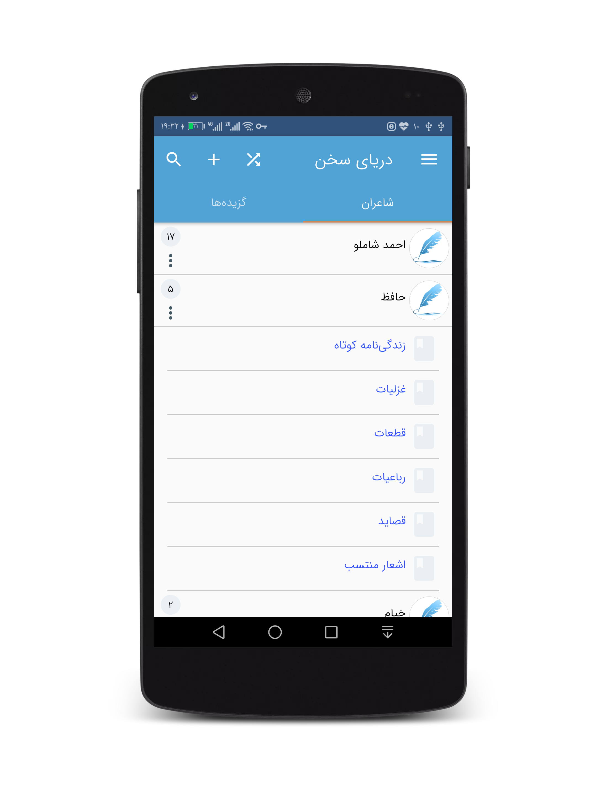
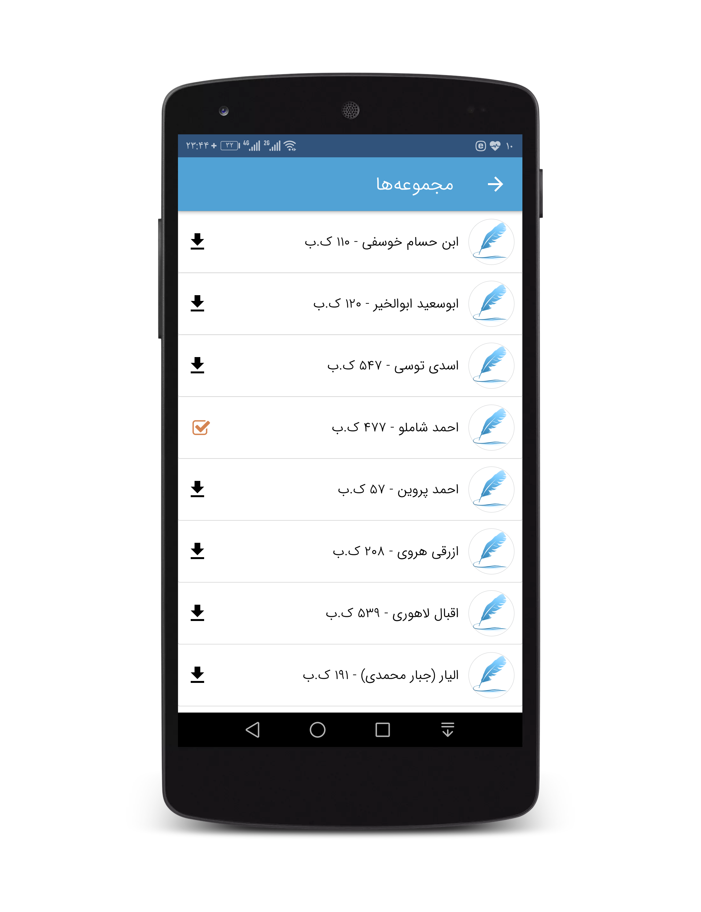
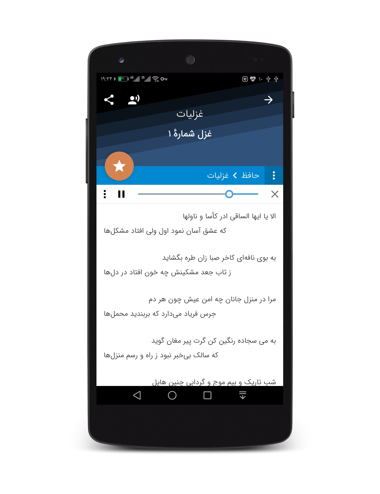

## دریای سخن (Daryaye sokhan)
‏‏پروژه دریای سخن کتابخانه‌ای بزرگ و ارزشمند از اشعار و سخنان شاعران گرانقدر ادب فارسی برپایه بانک اطلاعاتی گنجور است.  

The Daryaye Sokhan is a valuable library of poetry of Persian great poets.

 
## اطلاعات مفید (Useful information):
* IDE: Android Studio Android Studio Flamingo | 2022.2.1 Patch
* Programming language: Java

## پروژه‌های استفاده شده (Used repositories):
* [ganjooroid](https://github.com/ganjoor/ganjooroid)
* [ganjoor](https://github.com/ganjoor/ganjoor)
* [PhotoEditor](https://github.com/burhanrashid52/PhotoEditor)
* [Rastikerdar Fonts](https://rastikerdar.github.io/)

## لینک اپ (APK Link)
* [کافه‌بازار](https://cafebazaar.ir/app/ir.ham3da.darya)
* [مایکت](https://myket.ir/app/ir.ham3da.darya)

## 🙏 از توسعه پروژه حمایت کنید 
این پروژه به صورت متن‌باز و رایگان توسعه داده شده است.
برای ادامه این مسیر و افزودن قابلیت‌های جدید، لطفاً با مشاهده و خرید سایر محصولاتمان، از ما حمایت کنید:
* 👉 [مشاهده محصولات](https://ads.daryaye-sokhan.ir/)

## Donation with cryptocurrencies

* <b>Address:</b> 0xD6735B2457c3c1E25122220Cf3067C614Cf18Bc4 (Available on Ethereum, Binance Smart, Ethereum Classic and Polygon (Matic) networks)

## عکس‌هایی از محیط برنامه (Screenshots)

 
 

